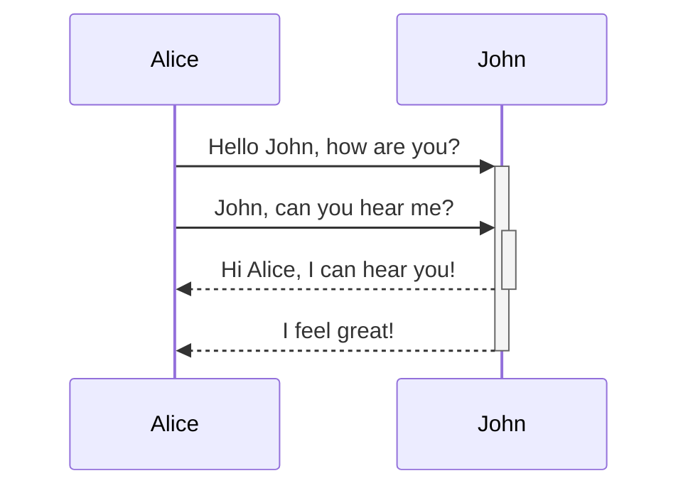
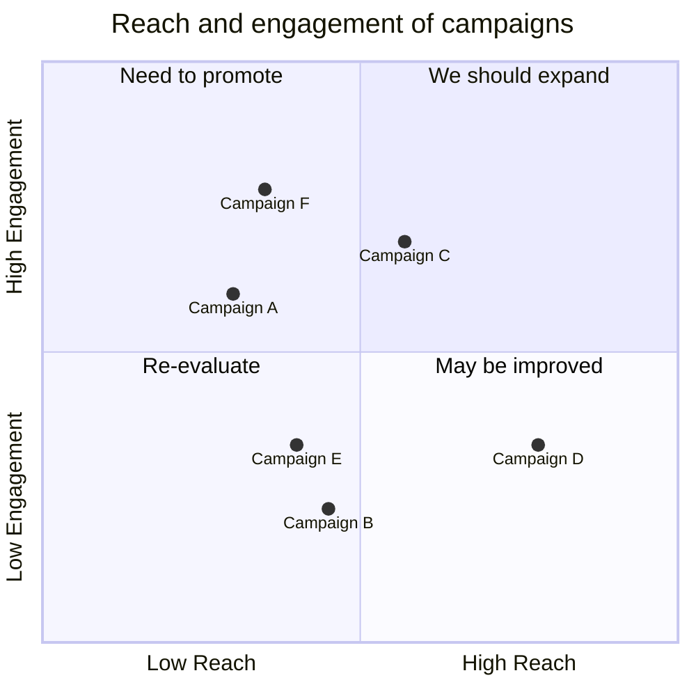
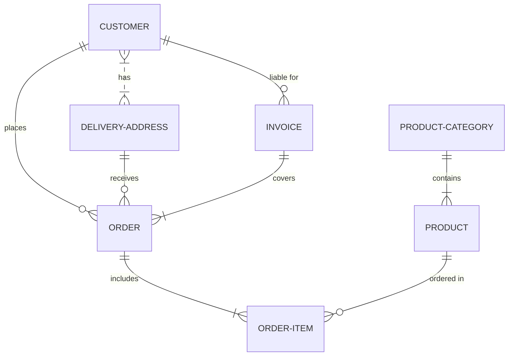

Hello, here is some documentation for you.
It is very well written.
Might have some spelling errors.
Hello!

```mermaid
sequenceDiagram
    Alice->>+John: Hello John, how are you?
    Alice->>+John: John, can you hear me?
    John-->>-Alice: Hi Alice, I can hear you!
    John-->>-Alice: I feel great!
```

```mermaid
quadrantChart
    title Reach and engagement of campaigns
    x-axis Low Reach --> High Reach
    y-axis Low Engagement --> High Engagement
    quadrant-1 We should expand
    quadrant-2 Need to promote
    quadrant-3 Re-evaluate
    quadrant-4 May be improved
    Campaign A: [0.3, 0.6]
    Campaign B: [0.45, 0.23]
    Campaign C: [0.57, 0.69]
    Campaign D: [0.78, 0.34]
    Campaign E: [0.40, 0.34]
    Campaign F: [0.35, 0.78]
```

```mermaid
erDiagram
          CUSTOMER }|..|{ DELIVERY-ADDRESS : has
          CUSTOMER ||--o{ ORDER : places
          CUSTOMER ||--o{ INVOICE : "liable for"
          DELIVERY-ADDRESS ||--o{ ORDER : receives
          INVOICE ||--|{ ORDER : covers
          ORDER ||--|{ ORDER-ITEM : includes
          PRODUCT-CATEGORY ||--|{ PRODUCT : contains
          PRODUCT ||--o{ ORDER-ITEM : "ordered in"
```